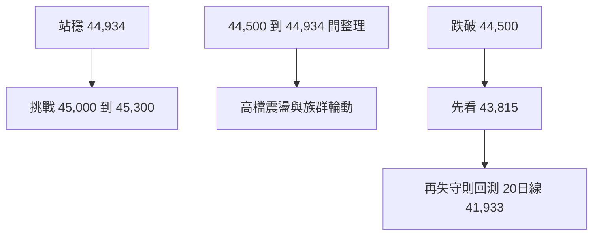

# 每日台股大盤盤前情緒與風險分析報告

## 執行摘要

以 **2026/05/29 台股現貨收盤**、**2026/05/29 15:00～2026/05/30 05:00 台指期夜盤**，以及 **2026/06/01 台北盤前可得的美股期貨、殖利率與波動率資料**來看，今日台股盤前基調仍偏多，但已從「單邊急拉」轉入「高檔震盪、題材輪動」階段。原因有三：第一，加權指數上週五大漲至 **44,732.94 點**、成交值 **1.816 兆元**，且三大法人同步買超、外資現貨買超達 **803.55 億元**，多方氣勢很強；第二，近月台指期夜盤收 **45,069 點**，雖仍維持高檔，但較日盤近月收盤 **45,285 點** 回落，代表追價力道有降溫；第三，外資台指期未平倉淨空單反而擴大到 **60,650 口**，顯示現貨大買的同時，期貨避險仍未鬆手。綜合判斷：今日最可能劇本是「開高或高檔震盪，盤中看族群輪動與量能能否續強」，不宜把 5/29 的長紅直接線性外推成再一根長紅。citeturn57search7turn36view0turn43search7turn28search0turn45news26turn39search0turn39search1turn40search1turn41search0

## 市場基準與外盤

資料時間基準如下：台股現貨、三大法人現貨與台指選擇權統計以 **2026/05/29 收盤後資料**為準；台指期夜盤以 **2026/05/29 15:00～次日 05:00** 官方盤後交易資料為準；國際市場的「前一交易日收盤」以 **美東 2026/05/29** 為準，「夜盤／盤前變動」則以 **美東 2026/05/31 晚間至台北時間 2026/06/01 盤前可得報價**為準；抓不到的欄位，以下直接標示 **未提供／未更新**。citeturn43search7turn55search0turn45news25turn39search0turn39search1turn38search20turn40search1turn41search0

**一、今日大盤總結**  
加權指數上週五收 **44,732.94 點**，大漲 **1,096.50 點、+2.51%**；盤中高點 **44,933.95**、低點 **43,815.48**，成交值 **1 兆 8,164.50 億元**。從型態看，這是明確的「價漲量增」，收盤也落在當日高檔區，但沒有收在最高，表示多方主導、同時高檔開始出現部分換手。citeturn57search7turn36view0

**二、台股夜盤分析**  

| 商品 | 最新可得夜盤價 | 夜盤量能 | 判讀 |
|---|---:|---:|---|
| 台指期近月 TX | 45,069 | 54,773 口 | 高檔回吐，意味週一較像震盪消化而非直接續噴 |
| 小台近月 MTX | 未提供 | 161,797 口 | 官方可得盤後量，顯示短線交易熱度高 |
| 電子期近月 TE | 未提供 | 92 口 | 盤後參與度明顯低於台指主契約 |
| 金融期近月 TF | 未提供 | 未提供 | 官方公開檢索未取得最新夜盤欄位 |

表內 TX 夜盤最後成交價與量能來自期交所盤後交易頁面；MTX、TE 的盤後成交量可由日盤行情頁揭露之「盤後交易時段成交量」取得，但最新夜盤最後成交價未在公開檢索結果中同步顯示，因此標示未提供。整體來看，夜盤重心仍在台指主契約，週末前多頭沒有被明顯破壞，但追價熱度已由「強攻」轉為「高檔整理」。citeturn43search7turn22search2turn22search0

**三、國際市場影響**  

| 指標 | 05/29 前一交易日收盤 | 夜盤／盤前最新可得變動 | 對台股可能影響 |
|---|---:|---:|---|
| 道瓊 | 51,032.46 | 期貨 51,092，約 +0.03% | 偏正面，但帶動有限 |
| S&P 500 | 7,580.06 | 期貨 7,603，約 +0.10% | 外圍風險偏穩，利多頭開盤 |
| Nasdaq | 26,972.62 | Nasdaq 100 期貨 30,471，約 +0.22% | 科技股情緒仍偏正向 |
| 費半 SOX | 12,829.38 | TAIFEX 美國費半期貨 12,917、漲 397 點 | 半導體氣氛偏多 |
| 台積電 ADR | 418.45 美元 | 盤後 419.06，約 +0.15% | 對台積電現貨開盤略偏正面 |
| 美債 10 年殖利率 | 4.453% | 4.461%，約 +0.20% | 利率小升，壓抑高本益比追價 |
| VIX | 15.32 | VIX futures 17.68，約 +0.52% | 避險情緒略回升，但未到恐慌 |

美股三大指數 5/29 全數收高並再創高，短線仍是風險資產有利環境；但台股盤前同時出現 **10 年殖利率小升、VIX futures 小升**，代表外資不是完全無風險偏好，今天更像「偏多但不宜失控追高」的盤。尤其台積電 ADR 現貨收跌、盤後才小幅回補，表示台股雖有開高條件，但權值股未必全面噴出。citeturn45news25turn45news26turn39search3turn39search0turn38search20turn39search1turn45search2turn46search0turn52search2turn40search0turn40search1turn41search0turn39search11

## 籌碼與事件風險

**四、法人與籌碼**  

| 項目 | 外資 | 投信 | 自營商 |
|---|---:|---:|---:|
| 05/29 現貨買賣超 | +803.55 億 | +60.97 億 | +154.26 億 |
| 05/29 台指期未平倉淨多空 | **-60,650 口** | **+46,926 口** | **+2,074 口** |
| 05/29 台指選擇權 OI 偏向 | 買權 +2,372、賣權 +5,043 | 未提供重點部位 | 買權 -3,888、賣權 +3,338 |

| 日期 | 外資現貨 | 投信現貨 | 自營商現貨 | 外資台指期淨多空 |
|---|---:|---:|---:|---:|
| 05/27 | +381.28 億 | -42.76 億 | -30.88 億 | -56,302 口 |
| 05/28 | -386.83 億 | -67.59 億 | -150.38 億 | -58,196 口 |
| 05/29 | +803.55 億 | +60.97 億 | +154.26 億 | -60,650 口 |

籌碼重點不是「外資大買」本身，而是 **期現背離**：外資現貨 5/29 大買超，但台指期淨空單卻從 **56,302 口 → 58,196 口 → 60,650 口** 連三日擴大，代表外資對現貨上漲並非完全裸多，而是明顯保留避險。選擇權方面，**Put/Call 成交量比 124.82、未平倉量比 222.36**，再加上自營商台指選擇權呈「買權淨空、賣權淨多」，整體仍偏防守，不是完全樂觀追價架構。citeturn57search1turn57search6turn57search7turn28search0turn55search0turn56view0turn58search0turn58search8

**五、新聞與事件風險**  
本週風險與題材集中在四件事：**COMPUTEX 6/2～6/5**、輝達執行長黃仁勳演講與對台投資題材、**台積電 2026/06/04 股東會**，以及美伊停火延長協議是否再出現反覆。Reuters 與中央社都指出，AI 展會與台積電公司治理／資本支出訊息，可能讓 AI 伺服器、PCB、散熱、組裝與半導體設備鏈維持高波動；同時，中東情勢若再反覆，油價、殖利率與 VIX 都可能回頭壓縮多頭評價。citeturn54news30turn54search1turn54search5turn54news31turn53search1turn41news31

## 結構與技術判讀

**六、產業輪動判斷**  
目前不是只靠台積電硬拉指數。從盤面結構看，**大盤扣除台積電仍上漲 2.39%**，與加權指數 **+2.51%** 接近；強勢族群除了半導體，還擴散到 **電腦及週邊、其他電子、數位雲端**，甚至 **塑膠、電器電纜** 也有補漲。中央社也明確指出，近期是 **AI 下游組裝廠接棒轉強**，屬於「健康輪動」，而不是單一權值股孤軍撐盤。相對偏弱的是純高價半導體續攻斜率，意味今天若要再漲，較可能靠 AI 組裝、伺服器零組件、PCB/CCL、散熱與部分傳產續輪動。citeturn36view0turn53search4

**七、大盤技術面**  
技術面仍明顯偏多。加權指數收 **44,732.94 點**，站上 **20 日均線 41,932.92** 與 **60 日均線 37,264.19**；5 日與 10 日均線也同步上彎。昨日量能 **18,199 億元**，高於 **20 日均量 12,580 億元**，屬於量能放大。唯一要留意的是，長紅後收盤未收在最高，代表 **44,934 前高** 以上會先遇到短線解套與獲利了結。今日可先看 **44,500／43,815** 為短支撐，強支撐看 **20 日線 41,933**；上檔先看 **44,934**，再看 **45,000～45,300** 壓力帶。citeturn36view0

情境可先用下圖快速記。上方壓力與下方支撐係依昨日高低點、均線與期貨高檔區推演。citeturn36view0turn43search7

## 盤中劇本與操作建議

**八、今日盤中劇本**  

| 情境 | 觀察條件 | 盤中看法 | 較佳做法 |
|---|---|---|---|
| 偏多延續 | 指數站穩 44,934，上攻 45,000；AI 組裝/PCB/散熱同步強 | 多頭續攻，但以輪動推升為主 | 回測承接，不追第一根急拉 |
| 高檔震盪 | 指數在 44,500～44,934 間反覆；權值穩但中小型輪動快 | 盤勢健康但追價報酬下降 | 短打強族群、降低持股集中度 |
| 轉弱修正 | 跌破 44,500，且台指期失守 45,000 附近 | 開高走低風險升高 | 減碼、縮槓桿、保留現金 |

選擇權觀察可先看近週合約成交活躍的 **44,500、45,000、45,500** 一帶；若 45,000 久攻不過，容易形成短線沖高回落。反過來說，只要 44,500 守住且輪動未散，大盤多頭結構仍未被破壞。citeturn59view0turn59view1turn59view2turn43search7turn36view0

**九、今日操作建議**  
今日建議定調為 **「偏多看待，但不追高、重風控」**。若開盤直接逼近 **44,934～45,000**，不適合追高的條件有三個：第一，只有台積電、金融或少數權值股撐盤，中小型 AI 族群不跟；第二，台指期無法重回日盤近月收盤 **45,285** 上方；第三，外資期貨淨空單高達 **60,650 口** 的壓力沒有鬆動。操作上，以回檔承接強勢輪動股優於高檔追價；跌破 **44,500** 要先縮短線部位，若再失守 **43,815**，就要把今天視為「長紅後整理日」而非續攻日。citeturn28search0turn43search7turn36view0turn53search4

## 今日關鍵數據總表

| 關鍵項目 | 最新值 | 結論 |
|---|---:|---|
| 加權指數 | 44,732.94 | 多頭仍強 |
| 昨日成交值 | 1.816 兆元 | 量能充足 |
| 台指期夜盤 | 45,069 | 高檔回吐、非失控轉弱 |
| 外資現貨 | +803.55 億 | 偏多 |
| 外資台指期 OI | -60,650 口 | 仍重避險 |
| P/C 未平倉比 | 222.36 | 防守意味濃 |
| 美股三大指數 | 全數收高 | 外盤偏正面 |
| 10Y 殖利率 | 4.461% 盤前 | 對高估值追價略不利 |
| 今日策略 | 偏多但不追高 | 看 44,934 壓力、44,500 支撐 |

這張表的核心結論只有一句：**台股大方向仍偏多，但今天較適合把它當成高檔換手盤，而不是無條件追價盤。**citeturn57search7turn43search7turn28search0turn55search0turn45news26turn41search0